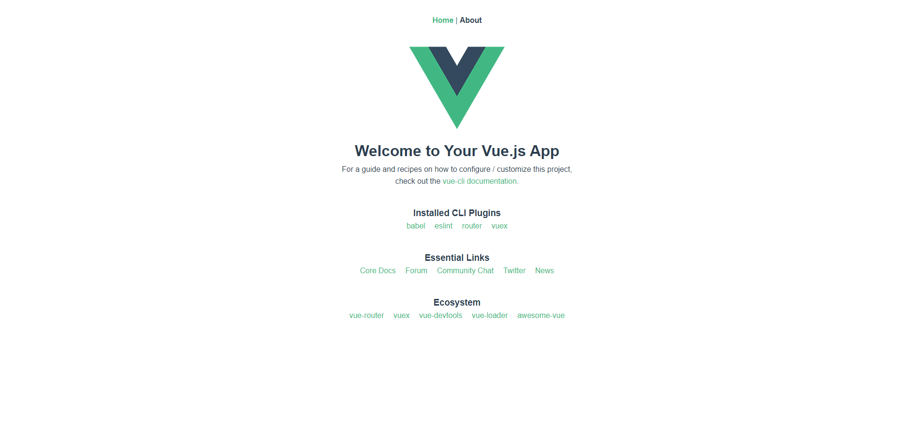

## 快速上手

Weui-Design-Vue 致力于提供给程序员愉快的开发体验。

> 官方指南假设你已了解关乎 HTML、CSS和JavaScript的中级知识，并且已经完全掌握了Vue及配套设施的正确开发方式。如果你刚开始学习前端或者Vue，将框架作为你的第一步可能不是好的主意——掌握好基础知识再来吧！

### 第一个本地实例

我们强烈建议使用官方的 `@vue/cli` 工具链辅助进行开发，下面我们用一个简单的示例来说明。

1.安装脚手架工具

> 使用 `@vue/cli` 前，务必确认[Node.js](https://nodejs.org/en)已经升级到v8.9或以上，强烈建议升级至最新版本的 `@vue/cli` 。如果你想了解更多CLI工具链的功能和命令，建议访问[Vue CLI](https://cli.vuejs.org/zh)了解更多。

```bash
$ npm install -g @vue/cli
```

2.创建一个项目

> 在创建项目之前，请确保 `@vue/cli` 已被成功安装。

执行以下命令， `@vue/cli` 会在当前目录下新建一个名称为 `PROJECT-NAME` 的文件夹，并自动安装好相应依赖。

```bash
$ vue create PROJECT-NAME
```

3.安装组件

进入项目文件夹，执行以下命令安装组件。

```bash
$ npm install --save weui-design-vue
```

4.引入组件

在 `src/main.js` 文件中引入组件和样式，文件中带有+++为引入配置

```bash
import Vue from 'vue'
import WeuiVue from 'weui-design-vue' +++
import 'weui-design-vue/lib/weui-design-vue.css' +++
import App from './App.vue'
import router from './router'

Vue.config.productionTip = false

Vue.use(WeuiVue) +++

new Vue({
  router,
  render: h => h(App)
}).$mount('#app')
```

注意：weui-design-vue.css若放在App下面引入，则weui-design-vue.css样式优先级高于项目样式，所以放在App上面引入

这样就成功在全局引入了 `weui-design-vue`

5.开发调试

一键启动调试，运行成功后显示欢迎页面。

```bash
$ npm run serve
```



6.构建和部署

```bash
$ npm run build
```

入口文件会构建到 `dist` 目录下，你可以自由部署到不同环境中进行引用。